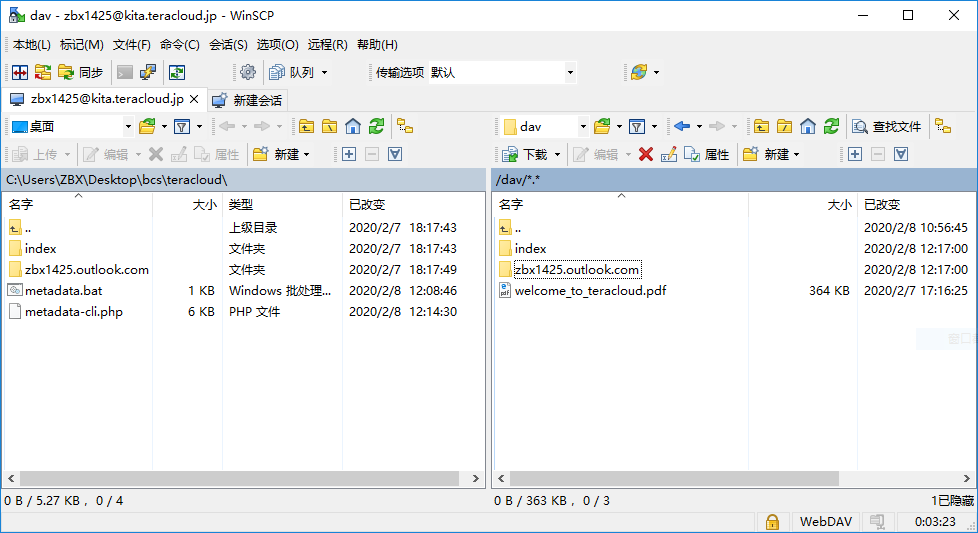

此处以TeraCloud为例。TeraCloud是个人目前为止了解的较为靠谱的外链网盘，若您有更好的选项欢迎联系。

### 注册账号

前往 [官网](https://teracloud.jp/en/) 注册账号。

值得注意的是，TeraCloud虽香，其并非共享网盘服务。因此，必须将密码提供给平台才能共享并下载您的文件。因此，建议您注册时**不要使用以往常用密码，而是使用新的，较为随机的数字与字母的组合作为密码，同时不要向网盘内存储个人文件。**

### 准备软件

1. （可选）虽然TeraCloud有一个线上管理网页，但是如果使用 [WinSCP](https://winscp.net/eng/download.php) 之类WebDAV管理软件则操作更加便捷。个人推荐您最好把它安装成两栏模式。

2. 公用源服务器会自动计算元数据，但网盘显然无此功能。因此，您还需要下载元数据生成器。由于懒惰，元数据生成器使用PHP语言编写。请从 [PHP官网](https://windows.php.net/download) 根据您的电脑下载最新的`x64 Thread Safe` ，或`x86 Thread Safe` 版本的Zip压缩包，并解压到`C:\php`。解压时请确保`php.exe `处在 `C:\php\php.exe` 的位置。

3. 请从 [Github](https://github.com/BVEContentService/MetadataGenerator) 下载元数据生成器，点击绿色小按钮并选择 `Download Zip`。将 `metadata.php` 与 `metadata.bat` 解压到您那以Email命名的文件夹**的父文件夹，即外侧文件夹中。**举个例子：

   ```
   │  metadata.php
   │  metadata.bat
   | 
   └─zbx1425.outlook.com
       │  author.ini
       │
       └─MTR Modified Initial System
               MTR Modified Initial System.html
               MTR Modified Initial System.png
               MTR Modified Initial System_1.0.ini
               MTR Modified Initial System_1.0_h2.zip
   ```

   

### 生成数据

1. 运行`metadata.bat`。您应该看到您所有的zip线路档被一一列出，同时Email命名的文件夹旁出现一个index文件夹。这时元数据已生成完成。
2. **在您修改信息、更改文件夹名或增加新线路档后，请不要忘记再次运行 `metadata.bat` 以刷新元数据。然后用Index文件夹中的文件替换网盘上的同名文件**。
3. 如果您使用TeraCloud以外的网盘业务，请修改 `metadata.bat` 中的链接。
4. 您可能会发现您的文件夹中出现类似 `***.thumb.jpg` 的文件。这些文件由系统自动维护，请将这些文件留在原处，不需编辑、删除和移动。如您要移除线路，将其与其它路线相关文件一同移除即可。

### 上传数据

1. 如您使用WinSCP，新建站点。注意调整以下配置：
   * 文件协议：WebDAV
   * 加密：SSL/TLS 隐式加密
   * 主机名：kita.teracloud.jp
   * 端口号：443（默认）
   * 用户名、密码：您比我清楚
   
   * **高级->目录->远程目录**：/dav
   
   如您使用这组配置时上传速度十分缓慢，您可尝试使用反向代理，也许能有所提升：
   
   * 主机名：teracloud.zbx1425.tk
   
   * 端口号：8953
   
2. 把`index`与您Email开头的文件夹上传到远端服务器。应该大致像这样：

   ```
   服务器根目录
   |
   ├─index
   │      authors.json
   │      packs.json
   │
   └─zbx1425.outlook.com
       │  author.ini
       │
       └─MTR Modified Initial System
               MTR Modified Initial System.html
               MTR Modified Initial System.png
               MTR Modified Initial System_1.0.ini
               MTR Modified Initial System_1.0_h2.zip
   ```

   

   

### 提交服务器

搭建好网盘之后，您需要把您的存储库提交到我们的索引，才能让它出现在程序中。

1. 前往 [提交页面](https://bvecontentservice.gitee.io/bcs-index/submission/)，填写相关信息。已经默认填写的区域是适于TeraCloud的配置项，如使用此网盘则不需更改。
2. 我们会人工核查您配置的网盘能否正常运作，请您静候佳音。

### 另见

网站的评论功能有些细节需要向您说明。见[此处](rssnotif.html)